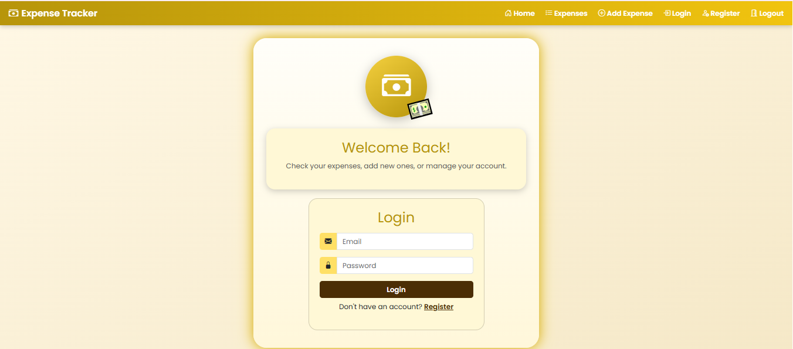
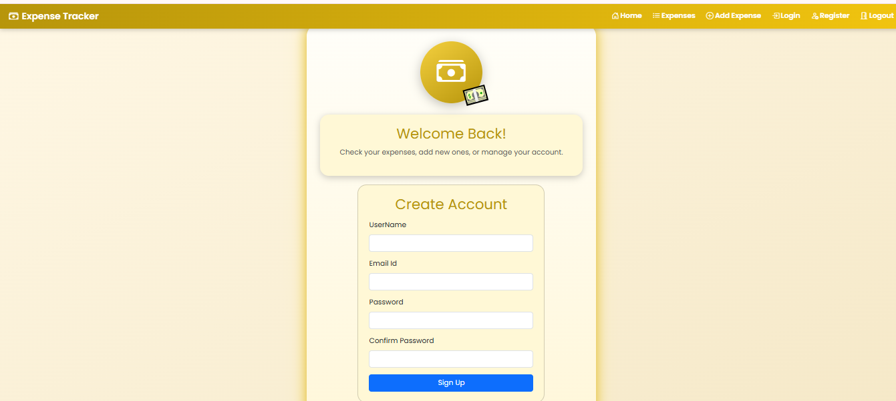
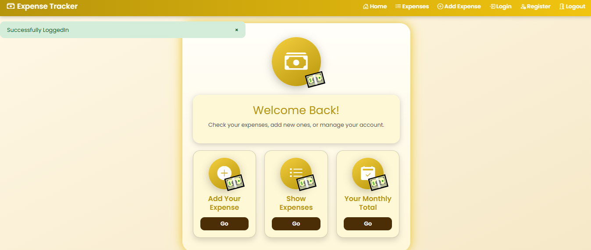
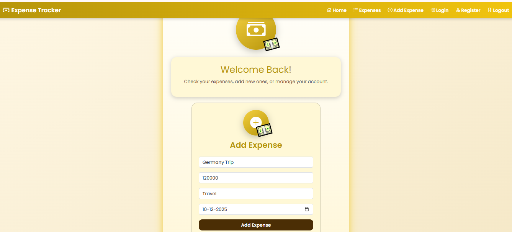
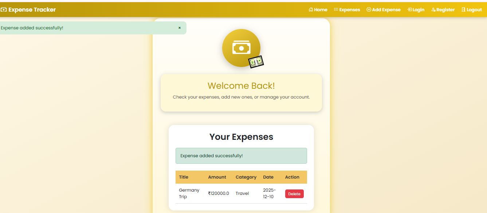
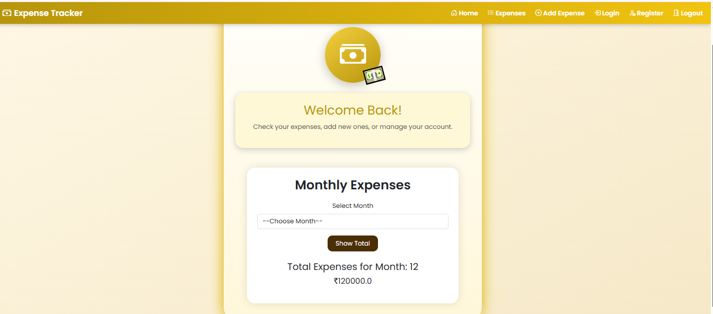

# Smart Expense Tracking Website

## 📌 Project Description
A responsive **expense tracking web application** built using **Flask** and **RESTful APIs** that allows users to add, edit, and view daily expenses. The application provides **monthly expense summaries** to help users analyze spending patterns effectively.

## 🎯 Impact
Improved personal expense tracking and monthly financial analysis using a structured **RESTful API–based backend**, enabling efficient data management and insights.

## 🛠️ Tech Stack
- Python
- Flask
- Flask-RESTful API
- Flask-SQLAlchemy
- HTML, CSS, Bootstrap
- SQLite 

## 📸 Screenshots

### 🏠 Home Page


### 🔐 Login Page


### 📝 Register Page


### 📋 Menu Page


### ➕ Add Expense Page


### 👁️ View Expense Page


### 📊 Monthly Expense Summary Page



## ✨ Features
- User authentication (Register & Login)
- Add, edit, and view expenses
- Monthly expense summary and analysis
- RESTful API–driven backend
- Responsive UI for all devices
- Secure data storage using SQLAlchemy

## 🚀 Local Setup Instructions
```bash
git clone https://github.com/your-username/your-repo-name.git
cd your-repo-name
pip install -r requirements.txt
python app.py
